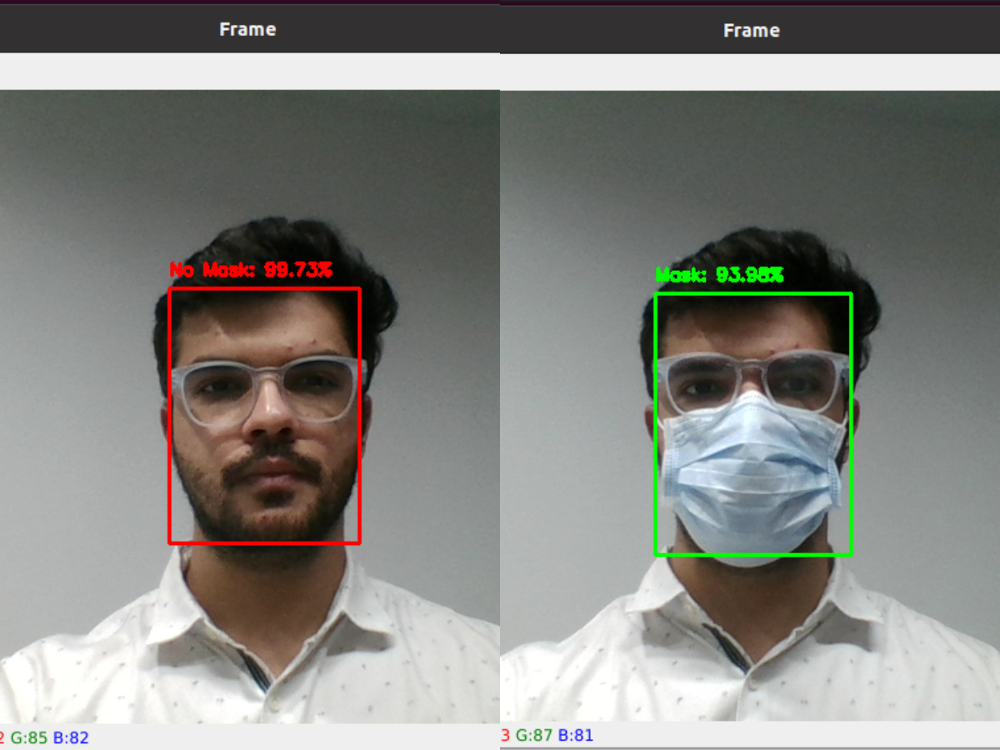

# Face Mask Detection using Deep Learning


## Objective:

The Covid-19 changed our lives and has changed our habits and also because of it many of us entered social isolation.

There are cities that are an obligation to use a mask when you are on the streets and also places like marts, supermarkets, etc that you have to use masks when you are inside of them.

Thinking about this problem, my idea is to create software to automatically detect if a person is using a mask or not.

The objective of this project is to train a deep convolutional neural network on images collected from the internet to check if a person is using a mask or not.


## Training

The neural network used is a [MobileNet V2](https://keras.io/applications/) with the fine-tuning modification on top of it. I used the **Keras** library to create the network.

```python
from tensorflow.keras.applications.mobilenet_v2 import MobileNetV2

base_model = MobileNetV2(weights='imagenet', include_top=False,input_shape=None, input_tensor=input_tensor)

headModel = baseModel.output
headModel = AveragePooling2D(pool_size=(7, 7))(headModel)
headModel = Flatten(name="flatten")(headModel)
headModel = Dense(128, activation="relu")(headModel)
headModel = Dropout(0.5)(headModel)
headModel = Dense(2, activation="softmax")(headModel)
```

The images were split into training and validation sets on 80/20 proportion. 

I used the **ImageGenerator** from Keras to automatically split the dataset. 

``` python
train_datagen = ImageDataGenerator(rescale=1./255,
    rotation_range=25,
    zoom_range=0.1,
    width_shift_range=0.1,
    height_shift_range=0.1,
    shear_range=0.2,
    horizontal_flip=True,
    fill_mode="nearest",
    validation_split=0.2) # set validation split
```

The images are on a folder called **"dataset"**.

The network was trained dusring 20 epochs and the final accuracy of around **90%** on the validation samples.

## Install Dependencies

Please install the requirements before running the python script.

``` shell
pip install -r requirements.txt
```
## Run Video Detection

You can run the prediction from an image selected from your cpu or using the webcam.

Please change the **SOURCE** variable to choose between them.

``` shell
python videoDetection.py
```


## Improvements and drawnbacks

- Label more images
- Include no face images class to train when the detect faces send bad images
- Improve accuracy performance
- Create an Android application
- Create a Web application
